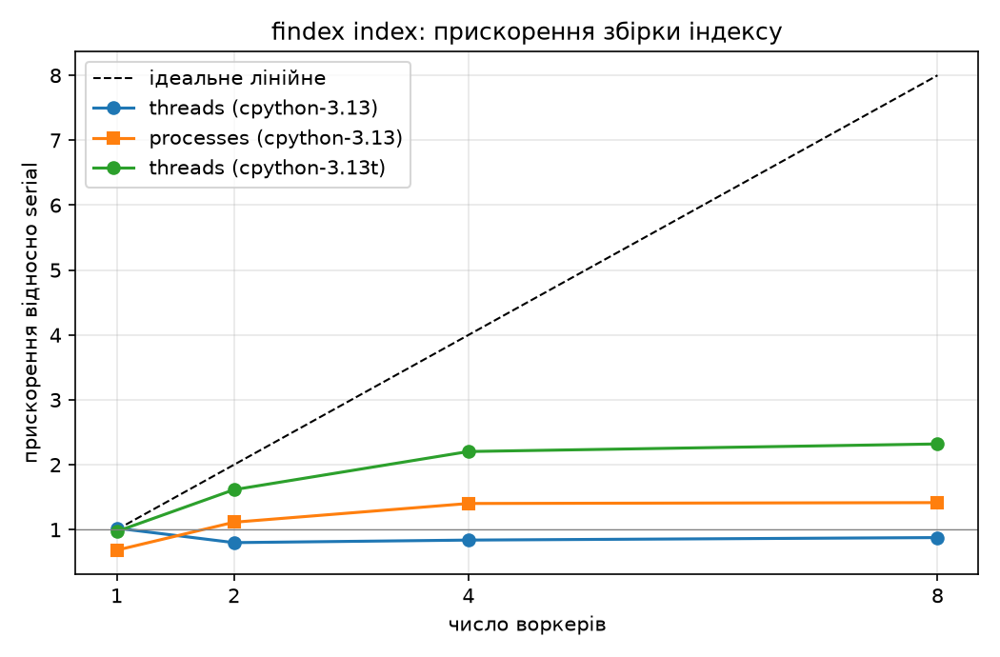

# findex — Лаба 8: профілювання, NumPy та семантичний пошук

**Один рядок:** `findex` — навчальна пошукова система по 200 книгах Project Gutenberg з BM25/TF-IDF, NumPy-оптимізацією та експериментальним semantic/hybrid search.

**Live demo:** https://findex-88lp.onrender.com  
**Версія:** 1.0.0 · **гілка:** `lab-08`

> **Search demo GIF:** presentation artifact to attach before defense.  
> **2–3 min demo video:** presentation artifact to attach before defense.

### Три числа

| Показник | Результат |
|---|---:|
| Corpus | **200 документів / 21,052,550 токенів** |
| Deployed p95 | **385.51 ms** |
| Найбільший speedup scorer | **7.01×** |

### Data path

```text
Project Gutenberg
      │
      ▼
data/gutenberg/*.txt
      │
      ├──► findex index ──► web/demo_index.json
      │                         │
      │                         └──► BM25 / TF-IDF / NumPy
      │
      └──► findex embed ──► web/demo_embeddings.npy + metadata.json
                                │
                                └──► semantic / hybrid
```

### Лабораторії 1–8 — коротка карта результатів

| Лаба | Основний результат |
|---|---|
| 1 | Lazy generators для корпусу та токенізації |
| 2 | Інвертований індекс і статистика |
| 3 | BM25 / TF-IDF та контроль порядку результатів |
| 4 | Індексація/пошук і CLI-пакування |
| 5 | Processes/threads, GIL, вимірювання паралельної індексації |
| 6 | Async crawler з retry, robots, limits та streaming JSONL |
| 7 | FastAPI web search, pagination, health-check, Render |
| 8 | cProfile/Scalene, NumPy postings, top-k, semantic/hybrid search, CI benchmarks |

## Лабораторна 8 — профілювання, NumPy і семантичний пошук

### Що зроблено

- cProfile для `findex index` і `findex search`;
- Scalene для розділення Python/native часу та пам'яті;
- NumPy postings: `int32` doc IDs, TF і довжини документів;
- vectorized BM25/TF-IDF та `np.argpartition` для top-k;
- pytest-benchmark для `search` і `build_index`;
- semantic embeddings через `sentence-transformers/all-MiniLM-L6-v2`;
- `lexical`, `semantic`, `hybrid` режими в CLI та web UI;
- RRF для hybrid;
- CI-перевірки;
- Docker build попередньо завантажує semantic model та будує demo embeddings.

### NumPy benchmark

| case | query | scorer | Python ms | NumPy ms | speedup |
|---|---|---|---:|---:|---:|
| frequent | `the` | bm25 | 0.488 | 0.086 | 5.70× |
| frequent | `the` | tfidf | 0.401 | 0.085 | 4.72× |
| rare | `aaasd` | bm25 | 0.006 | 0.057 | 0.11× |
| rare | `aaasd` | tfidf | 0.006 | 0.044 | 0.14× |
| 3-term | `the event loop` | bm25 | 0.770 | 0.120 | 6.44× |
| 3-term | `the event loop` | tfidf | 0.677 | 0.097 | 7.01× |

Для рідкісного терма прискорення відсутнє: на дуже малому posting list overhead NumPy перевищує виграш від vectorization.

### Semantic evaluation

- 10 labeled Lab 3 queries: mean Precision@5 = **0.46**.
- 5 paraphrases without document words: mean Precision@5 = **0.08**.
- Combined mean over 15 queries: **0.333**.
- Embeddings: **10,892 chunks × 384 float32**, 200 documents.

Semantic mode тому позиціонується як експериментальний: він додає інший сигнал, але на цьому малому labeled set не демонструє стабільної переваги над lexical retrieval.

### Profiling conclusions

1. Search CLI значною мірою витрачає час на завантаження та JSON-десеріалізацію великого індексу, а не на сам scorer.
2. Index save витрачає значний час на JSON encoding Python object graph.
3. Scalene показав, що реконструкція `Posting(...)` у `InvertedIndex.load` є Python-heavy; NumPy arrays зменшують цю object overhead для scoring.
4. Для відтворюваності додано `.github/workflows/lab8-artifacts.yml`, який у Linux CI генерує cProfile, py-spy flame graphs, Scalene JSON та semantic Precision@5 artifact.

### Benchmark tests

```text
test_benchmark_search:
  median 77.8001 us
  mean   80.9186 us
  12,358.10 ops/s

test_benchmark_build_index:
  median 1,867.7001 us
  mean   2,008.5719 us
  497.87 ops/s
```

### Limitations

- semantic model `all-MiniLM-L6-v2` is CPU-based and increases image size/build time;
- semantic quality is sensitive to chunking and the small labeled evaluation set;
- rare posting lists can be faster with the original Python scorer;
- persisted inverted index is still JSON, so CLI startup/load remains a major cost;
- `py-spy` flame graph was not produced because of the Windows/Python 3.13 profiler limitation;
- search GIF and 2–3 minute video are manual presentation artifacts and must be attached before defense.

---
# Лабораторна 1 — ітератори, генератори та корпус

Перший крок власної пошукової системи `findex` (курс «Python — Build a Search Engine»).
Ідея лаби: корпус будь-якого розміру проходить через токенізацію та підрахунок термів
через ліниві генераторні конвеєри, тож пам'ять не росте разом із кількістю документів.

## Корпус

**Project Gutenberg** — публічні книги в plain-text (`.txt`), один документ = одна книга.
Корпус не в git (`data/` у `.gitignore`), завантажити його можна скриптом:

```bash
uv run python scripts/download_gutenberg.py --count 200   # файли в data/gutenberg/
```

Скрипт робить паузу між запитами (1,5 с), повторює невдалі запити до трьох разів і вміє продовжити завантаження після зупинки.

Джерело: <https://www.gutenberg.org>. Кількість книг: **200 шт., 119,1 МіБ (124 905 823 байти)**.

## Встановлення і запуск

```bash
uv sync
uv run pytest                                   # тести
uv run ruff check .                             # лінтер
uv run python -m findex.stats data/gutenberg    # статистика (весь корпус)
uv run python -m findex.stats data/gutenberg --limit 20 --top 10   # перші 20 документів
uv run python -m findex.bench data/gutenberg --limits 25 50 100    # eager vs lazy
```

Виводить: кількість документів, токенів, розмір словника, топ-50 термів, час та пікову пам'ять (`tracemalloc`).

## Структура

```
src/findex/
  corpus.py     iter_documents(root) -> Iterator[Document]   (генератор; каталог .txt або .jsonl)
  tokenize.py   tokenize(text) -> Iterator[str]              (генератор)
  stats.py      lazy-конвеєр + вимірювання + `python -m findex.stats`
  eager.py      навмисно «жадібна» версія (списки) для порівняння
  bench.py      таблиця eager vs lazy
tests/          test_tokenize.py, test_corpus.py
scripts/        download_gutenberg.py
```

`iter_documents` читає **один файл за раз** (`rglob` — теж лінивий), `Document` — `NamedTuple(doc_id, path, text)`.
Файли з некоректним UTF-8 не валять програму: логуємо попередження і читаємо з `errors="replace"`.
Також підтримується один `.jsonl`-файл (по документу на рядок, поле `"text"`); биті рядки пропускаються з логом.
Порядок документів — порядок обходу файлової системи (не відсортований), щоб не матеріалізувати список шляхів.

Лінивість видно на вимірі: перший документ корпусу читається за **0,001 с**, усі 200 документів — за **0,51 с**.

## Правила токенізатора

| Рішення      | Правило                                                                  | Приклад                                             |
| ------------ | ------------------------------------------------------------------------ | --------------------------------------------------- |
| Нормалізація | `NFC`, потім `casefold()` (не `lower()`)                                 | `cafe\u0301` → `café`; `Straße` → `strasse`         |
| Токен        | послідовність літер/цифр `[^\W_]+` (`\w` розуміє Unicode, `_` виключено) | `Привіт` → `привіт`; `snake_case` → `snake`, `case` |
| Апострофи    | всередині слова **зберігаються**; `’ ʼ ′` → `'`                          | `don't`, `п'ять` = `п’ять`                          |
| Дефіси       | **розбивають** слово                                                     | `well-known` → `well`, `known`                      |
| Цифри        | зберігаються в токені; крапка розбиває                                   | `2024`, `abc123`; `3.14` → `3`, `14`                |

Реалізація через `re.finditer` (не `findall`), тому токени віддаються по одному.
Наслідок політики щодо цифр: токени `1`, `0` і `2` потрапляють у топ-50 (нумерація розділів і віршів, дати).

## Вимірювання: eager vs lazy

Машина: AMD Ryzen 3 7320U, 16 ГБ RAM, Windows, Python 3.13.12. Один і той самий корпус і однакові `--limit`;
обидві версії міряються під `tracemalloc` (він сповільнює обидві однаково, тому порівняння чесне).
Команда: `uv run python -m findex.bench data/gutenberg --limits 25 50 100`.

| Version           | Documents | Tokens   | Peak memory | Elapsed |
| ----------------- | --------- | -------- | ----------- | ------- |
| eager (lists)     | 25        | 3801102  | 228.9 MiB   | 26.01 s |
| lazy (generators) | 25        | 3801102  | 83.2 MiB    | 25.60 s |
| eager (lists)     | 50        | 6784438  | 410.5 MiB   | 46.88 s |
| lazy (generators) | 50        | 6784438  | 83.2 MiB    | 46.03 s |
| eager (lists)     | 100       | 12968709 | 792.0 MiB   | 96.07 s |
| lazy (generators) | 100       | 12968709 | 136.9 MiB   | 89.72 s |

**Повний корпус, lazy:** 200 документів, 20 799 989 токенів, словник 506 682, пік 136,9 МіБ, 159,0 с.
Топ-5 термів: `the` (1 128 749), `and` (668 086), `of` (631 021), `to` (468 654), `a` (376 017).

### Чому числа різні

Пік eager росте лінійно: 228,9, 410,5 і 792,0 МіБ на 25, 50 і 100 документах, тобто стабільно близько 63–64 байтів
на токен. Це ціна списку списків токенів: кожен токен є окремим об'єктом `str` (~55 байтів) плюс вказівник у списку (8 байтів).
Окрім нього eager тримає тексти всіх документів і `Counter`. На 100 документах пік eager у 5,8 раза більший,
ніж у lazy (792,0 проти 136,9 МіБ), і розрив зростає разом із корпусом.

Пік lazy залежить не від кількості документів, а від найбільшого документа в обробці: він однаковий (83,2 МіБ) на 25 і 50
документах, а на 100 документах стрибає до 136,9 МіБ і на всьому корпусі з 200 не змінюється. Найбільші файли корпусу:
`pg200.txt` (7,9 МіБ) та `pg100.txt` (5,4 МіБ). У пам'яті в найважчий момент лежать текст такого документа,
тимчасові копії тексту після `normalize`/`casefold`/`translate` і `Counter`, що вже накопичив частину словника.
Тому lazy не нуль, але й не росте разом із корпусом.

Час майже однаковий: 26,0 проти 25,6 с на 25 документах і 96,1 проти 89,7 с на 100 (різниця до 7%). Обидві версії
виконують ту саму роботу, тому лінивість економить пам'ять, а не процесорний час.

## Тести

`tests/test_tokenize.py` — 10 перевірок (регістр, кирилиця, комбінований акцент, пунктуація, порожній рядок, апострофи, дефіси, цифри, casefold, генераторність).
`tests/test_corpus.py` — генераторність, ліниве читання, биті кодування, `.jsonl`, відсутній каталог.
Результат: `15 passed`, `ruff check` — без зауважень.


# Лабораторна 5 — конкурентність і GIL: паралельна індексація

## Запуск

```
uv sync
uv run findex index data/gutenberg --workers 4 --executor processes -o index.json
uv run python -m findex.bench5 data/gutenberg --repeats 3          # звичайний CPython
uv run python scripts/gil_demo.py                                  # GIL, гонитва, I/O
uv run python scripts/plot_lab5.py
uv run pytest
```

## Машина і методика

Машина: AMD Ryzen 3 7320U with Radeon Graphics, логічних ядер (os.cpu_count): 8, ОС: Windows-11-10.0.26200-SP0. Корпус: 200 документів, словник 504036 термінів. Python 3.13.12 (sys._is_gil_enabled() = True); вільнопотокова збірка: Python 3.13.15 (sys._is_gil_enabled() = False).

Кожна клітинка (executor × workers) міряється щонайменше тричі; у таблицю йде медіана. Кожен запуск — окремий свіжий процес Python (python -m findex.bench5 --one), тому пік пам'яті і CPU-час не успадковують нічого від попередніх запусків. Перед серією робиться один прогрівальний запуск (холодний кеш файлів не потрапляє в таблицю). Збірка міряється без запису індексу на диск.

- Wall — time.perf_counter() від старту збірки до готового індексу (включно з plan_chunks, передачею результатів воркерів і merge).
- CPU — time.process_time() батьківського процесу; для processes додається сума CPU-часу воркерів (time.thread_time() усередині build_partial). Старт інтерпретатора воркера і імпорти в цю суму не входять, тож вона трохи занижена.
- Пік RSS — найвищий resident set саме батьківського процесу (Windows: PeakWorkingSetSize, Linux: ru_maxrss). Пам'ять воркерів сюди не входить.
- Merge — окремий таймер навколо merge(); це послідовна частина збірки.
- Прискорення — wall serial на звичайній збірці CPython поділити на wall клітинки; одна й та сама база для рядків 3.13t, щоб їх можна було порівнювати.
- Шматків: 1 для serial і для workers=1, інакше workers×4 (більше шматків, ніж воркерів, вирівнює навантаження: файли корпусу дуже різного розміру). Шматки неперервні й зважені за розміром файлів.

## Результати

**Таблиця 1 — збірка повного корпусу (медіана ≥ 3 запусків; прискорення відносно serial на cpython-3.13)**

| Інтерпретатор | Executor | Workers | Wall, с | CPU, с | Пік RSS батька, МіБ | Merge, с | Прискорення |
|---|---|---|---|---|---|---|---|
| cpython-3.13 | serial | 1 | 28,91 | 28,55 | 445 | 0,66 | 1,00× |
| cpython-3.13 | threads | 1 | 28,25 | 27,86 | 445 | 0,59 | 1,02× |
| cpython-3.13 | threads | 2 | 36,12 | 35,72 | 506 | 0,73 | 0,80× |
| cpython-3.13 | threads | 4 | 34,43 | 34,42 | 528 | 2,98 | 0,84× |
| cpython-3.13 | threads | 8 | 32,92 | 32,94 | 592 | 2,96 | 0,88× |
| cpython-3.13 | processes | 1 | 42,27 | 33,16 | 656 | 0,54 | 0,68× |
| cpython-3.13 | processes | 2 | 25,94 | 42,67 | 457 | 2,29 | 1,11× |
| cpython-3.13 | processes | 4 | 20,60 | 51,20 | 479 | 2,15 | 1,40× |
| cpython-3.13 | processes | 8 | 20,40 | 53,72 | 513 | 1,01 | 1,42× |
| cpython-3.13t | serial | 1 | 29,37 | 29,20 | 499 | 0,92 | 1,00× |
| cpython-3.13t | threads | 1 | 29,74 | 29,62 | 501 | 0,95 | 0,97× |
| cpython-3.13t | threads | 2 | 17,89 | 31,86 | 605 | 1,24 | 1,62× |
| cpython-3.13t | threads | 4 | 13,11 | 38,14 | 719 | 1,48 | 2,20× |
| cpython-3.13t | threads | 8 | 12,46 | 56,83 | 1023 | 1,64 | 2,32× |

**Таблиця 2 — закон Амдала для processes: послідовна частка f = merge / serial wall = 3,5 %, стеля 1/f = 28,57×**

| Workers | Виміряно | Амдал 1/(f+(1−f)/N) |
|---|---|---|
| 1 | 0,68× | 1,00× |
| 2 | 1,11× | 1,93× |
| 4 | 1,40× | 3,62× |
| 8 | 1,42× | 6,43× |



*Рисунок 1 — прискорення збірки індексу від числа воркерів (пунктир — ідеальне лінійне)*

## Чому так: GIL, процеси, Амдал, 3.13t

Потоки під GIL. Найкраще прискорення потоків — 1,02× при 1 воркерах. Тобто практично нуль. Індексація — це токенізація і оновлення словників, тобто чистий Python-байткод, а GIL дозволяє виконувати байткод лише одному потоку одночасно. Вісім потоків не працюють паралельно: вони по черзі беруть GIL (кожні 5 мс інтерпретатор просить поточний потік його віддати) і чекають одне одного. Додатково з'являються витрати на перемикання і гірший кеш процесора, тому потоки можуть вийти навіть трохи повільнішими за serial. Читання файлів GIL відпускає, але воно становить малу частку часу порівняно з токенізацією.

Процеси. Найкраще прискорення — 1,42× при 8 воркерах. Кожен процес має власний інтерпретатор і власний GIL, тож токенізація йде на різних ядрах справді паралельно. Але це не безкоштовно. Процес запускається методом spawn: новий інтерпретатор імпортує модулі заново. Результат воркера (частковий індекс з сотнями тисяч термінів) серіалізується через pickle, іде по каналу і десеріалізується в батьківському процесі. Тому сумарний CPU-час більший, ніж у serial: 53,72 с проти 28,55 с на 8 воркерах, тоді як wall впав до 20,40 с проти 28,91 с. Різниця між CPU і wall — ціна паралелізму: ядра зайняті одночасно, а частина їхньої роботи — накладні витрати. Пам'ять: пік RSS батьківського процесу 513 МіБ проти 445 МіБ у serial (батько тримає отримані часткові індекси і збирає з них результат), а кожен воркер додатково тримає власну копію інтерпретатора і свій частковий індекс — їх RSS у таблиці не враховано, тож реальне споживання пам'яті системою більше за цю колонку.

Закон Амдала. Merge виконується в одному процесі, поки решта чекає. На 8 воркерах він займає 1,01 с, тобто f = 3,5 % від wall serial (28,91 с). За законом Амдала S(N) = 1/(f + (1−f)/N), тому навіть з нескінченною кількістю ядер прискорення не перевищить 1/f = 28,57×; для 8 воркерів формула дає 6,43×, а виміряно 1,42× (див. таблицю 2). Це лише нижня оцінка послідовної частки: в неї не входить десеріалізація результатів воркерів у батьківському процесі і запуск процесів, тому реальна стеля нижча; різницю між формулою і виміром варто пояснити саме цим.

Збірка 3.13t. На вільнопотоковому інтерпретаторі (sys._is_gil_enabled() = False) ті самі ThreadPoolExecutor-потоки дали 2,32× при 8 воркерах (процеси на звичайній збірці — 1,42×). Потоки тепер справді виконують байткод паралельно, не платять за pickle і працюють у спільній пам'яті, тож CPU-час і RSS мають бути ближчими до serial, ніж у processes — звір це з таблицею 1. Merge лишається послідовним, тому Амдал діє й тут. Ціна — повільніший одноядерний інтерпретатор (дивись рядок serial на 3.13t, якщо він є).


# Лабораторна 6 — асинхронний crawler (`asyncio`)

## Що додано

- `findex crawl` — асинхронний краулер на `asyncio__, `TaskGroup__, `Queue__, global/per-host semaphores.
- `httpx.AsyncClient` з одним connection pool на crawl; таймаут через `asyncio.timeout`.
- Retry тільки для 429, 5xx та timeout; максимум 3 повтори, exponential backoff + jitter; `Retry-After` враховується. Інші 4xx не повторюються.
- `RobotsCache` окремо кешує `robots.txt` для кожного host; при недоступному robots.txt застосовується fail-closed політика.
- Чесний User-Agent: `findex-lab06/1.0 (+https://github.com/8502568-ship-it/findex)`.
- Canonical URL: lowercase scheme/host, без fragment, нормалізований trailing slash і відсортований query.
- HTML/text/link extraction через стандартний `html.parser`.
- JSONL пишеться потоком; індексація запускається окремою командою після завершення crawl і не блокує event loop.
- `crawl.log` містить статус, bytes, elapsed і retry для URL.
- Тести використовують `httpx.MockTransport`, живої мережі не потребують.

## Дозвіл на crawling

Для здачі використано **локальне дзеркало**, яке запускається скриптом `scripts/lab6_mirror.py` на `127.0.0.1`. Воно створює 220 тестових сторінок і власний `robots.txt`, тому зовнішній сайт не навантажується. Для реального сайту запускати crawler слід лише там, де crawling дозволений власником; robots.txt та domain allowlist обов'язкові.

## Запуск

```bash
uv sync
uv run pytest
uv run ruff check .

# локальний mirror
uv run python scripts/lab6_mirror.py --port 8765

# в іншому terminal
uv run findex crawl http://127.0.0.1:8765/page/0 --max-pages 200 --concurrency 20 --per-host 20 --host-delay 0 --out data/crawl.jsonl --log-file crawl.log
uv run findex index data/crawl.jsonl -o index.json
uv run findex search index.json "async crawler"
```

> Якщо локальний `uv.lock` ще не містить нової залежності `httpx`, один раз виконайте `uv lock`, після чого `uv sync`.

## Benchmark Lab 6

Однакова seed-адреса і `max_pages=200`; локальний mirror має затримку 50 ms на HTTP-відповідь. Це контрольований експеримент, а не вимірювання зовнішнього сайту.

| Concurrency | Pages | Wall, s | Pages/s | Errors | Peak RSS, MiB |
|---:|---:|---:|---:|---:|---:|
| 1 | 200 | 10.654 | 18.77 | 0 | 103.43 |
| 5 | 200 | 2.529 | 79.09 | 0 | 103.43 |
| 20 | 200 | 2.226 | 89.86 | 0 | 103.80 |

Команди benchmark: `uv run python scripts/bench_async.py http://127.0.0.1:8765/page/0 --max-pages 200 --per-host 20 --concurrency N`, окремий запуск для `N=1`, `N=5` та `N=20`.

### Пояснення

**Чому 20 одночасних запитів швидші за Lab 5:** у crawler робота переважно I/O-bound: один потік не виконує CPU-роботу під час очікування socket response, а event loop перемикається на іншу готову coroutine. На контрольному mirror wall time впав з 10.654 s при 1 worker до 2.226 s при 20.

**Ціна per-host limit:** він може зменшити максимальний throughput одного сервера, бо запити чекають semaphore і minimum delay. Ліміт залишений навмисно: він захищає сервер від burst/DoS-подібного навантаження; глобальний semaphore одночасно обмежує загальну кількість in-flight requests.

**Де event loop блокувався б при індексації всередині coroutine:** токенізація, побудова posting dictionaries та інший CPU-bound Python-код не мають `await`, тому один великий документ зайняв би thread event loop і всі інші мережеві задачі чекали б. Тому crawl тільки збирає raw pages; `findex index` виконується після нього.

**Оброблений збій — 429:** retry використовує `Retry-After`. При тесті через MockTransport журнал містив:

```
WARNING url=https://example.test/fail status=429 attempt=1 retry_in=0.00s
INFO    url=https://example.test/fail status=200 bytes=2 elapsed=0.001s attempts=2
```

## Reflection

1. На `await client.get()` coroutine віддає керування event loop; loop чекає readiness socket і відновлює task, коли I/O готове.
2. Async concurrency cooperative: безпечніше спільний стан між `await`, але небезпечно мати blocking call. Потоки preemptive, тому потребують synchronization primitives частіше.
3. `time.sleep(1)` блокує весь loop; `await asyncio.sleep(1)` дозволяє іншим tasks працювати.
4. `async def f()` при виклику створює coroutine object; виконання починається через `await` або task.
5. `TaskGroup` задає lifetime tasks і при exception скасовує siblings та піднімає `ExceptionGroup`.
6. Lab 5 індексує CPU-bound Python, де GIL обмежує threads; Lab 6 очікує мережу, тому async перекриває latency.
7. `CancelledError` спеціально має проходити крізь cleanup; ковтання cancellation ламає structured shutdown.
8. Global semaphore обмежує весь crawler, per-host — одного сервера; `Retry-After` змінює звичайну оцінку backoff, коли сервер явно задає wait time.
9. CPU work під час crawl треба винести після crawl або в ProcessPoolExecutor.

## Definition of done

- [x] timeout/retry/backoff/jitter/Retry-After;
- [x] robots.txt, User-Agent, domain allowlist, per-host + global limits;
- [x] Queue + TaskGroup + async generator + canonicalization + seen;
- [x] streaming JSONL + Rich live counters + crawl.log;
- [x] MockTransport tests; no blocking sleep in crawler;
- [x] benchmark for 1/5/20 and reflection;
- [x] local permission/mirror documented;
- [ ] final git tag `lab-06` — створити після локальної перевірки та push.

# Лабораторна 7 — FastAPI web search

**Версія: 0.7.0 · тег: `lab-07`**

> **Live demo:** https://findex-88lp.onrender.com

## Запуск

```bash
uv sync
FINDEX_INDEX_PATH=web/demo_index.json FINDEX_DOCS_PATH=web/demo_docs.jsonl uv run findex serve --port 8000
```

Windows PowerShell:

```powershell
$env:FINDEX_INDEX_PATH="web/demo_index.json"
$env:FINDEX_DOCS_PATH="web/demo_docs.jsonl"
uv run findex serve --port 8000
```

Docker:

```bash
docker build -t findex:0.7.0 .
docker run --rm -p 8000:8000 -e FINDEX_INDEX_PATH=/app/web/demo_index.json -e FINDEX_DOCS_PATH=/app/web/demo_docs.jsonl findex:0.7.0
```

## HTTP API

- `GET /` — Jinja2 search page with snippets, highlighting, scores and pagination.
- `GET /search?q=asyncio&k=10&scorer=bm25&page=1` — paginated JSON search.
- `GET /docs/{doc_id}` — full document, 404 for an unknown id.
- `GET /stats` — index statistics.
- `GET /health` — 200 after the index is loaded, otherwise 503.

`lifespan` loads the index once. Pydantic models validate HTTP input and serialize responses; internal search remains on the Lab 2–3 dataclasses. CPU-bound synchronous search is executed with `asyncio.to_thread`, so the event loop is not blocked by that work. Unexpected exceptions are logged with `X-Request-ID` and exposed as a generic 500 response.

## ASGI path and def vs async def

Socket → Uvicorn/ASGI → request scope → FastAPI routing/dependencies → endpoint → response serialization → ASGI send → socket.

An `async def` endpoint can yield control at `await` points. A normal `def` endpoint is run by Starlette in a thread pool, keeping blocking synchronous code away from the event loop. Here the search core remains synchronous CPU work, so the async endpoint uses `asyncio.to_thread`.

## Тести

Web acceptance tests use FastAPI `TestClient` and `dependency_overrides`; no real index file is needed. Covered cases: successful search, Pydantic 422, unknown document 404, and unloaded-index health 503.

```bash
uv run pytest tests/test_web.py
```

## Load test

The reproducible helper was used with 50 concurrent local requests and 20 requests against the deployed service:

```bash
uv run python scripts/bench_web.py http://127.0.0.1:8000/search --requests 50 --mode async
uv run python scripts/bench_web.py https://findex-88lp.onrender.com/search --requests 20 --mode async
```

For the `def` row, `FINDEX_SEARCH_MODE=def` selects a real synchronous FastAPI endpoint; the benchmark client still uses the same async concurrent load so the server implementations are compared under the same client-side load.

| Variant | Requests/s | p50 | p95 | p99 |
|---|---:|---:|---:|---:|
| 1 worker, async def | 90.96 | 181.13 ms | 199.93 ms | 211.52 ms |
| 1 worker, def | 98.15 | 146.83 ms | 162.86 ms | 167.51 ms |
| 4 workers, async def | 97.16 | 159.54 ms | 179.51 ms | 180.55 ms |
| deployed service | 25.82 | 286.59 ms | 385.51 ms | 425.69 ms |

The Lab 7 table above records the measured local and deployed load-test results. Lab 5 showed that pure-Python CPU indexing is constrained by the GIL; moving work to a thread pool keeps the event loop responsive but does not remove the GIL. Multiple Uvicorn worker processes provide separate interpreters and can use multiple CPU cores, with additional memory/process overhead.

## Docker and deployment

The image is multi-stage and uses `uv.lock`. The final process runs as UID/GID 65532 rather than root. `render.yaml` configures a Render Docker service and `/health` health check. Runtime paths are environment variables (`FINDEX_INDEX_PATH`, `FINDEX_DOCS_PATH`).

## Reflection

1. The event loop switches at explicit `await` points.
2. Pydantic rejects invalid HTTP input at the boundary while internal dataclasses stay simple.
3. `to_thread` prevents synchronous search from monopolizing the event-loop thread; it does not remove the GIL.
4. Multiple processes provide separate interpreters/GILs for CPU-bound work.
5. `lifespan` loads the index once per worker instead of once per request.
